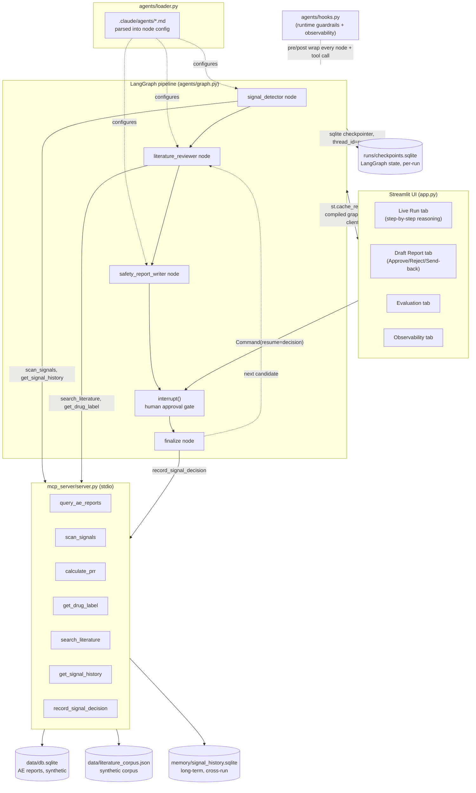

# Architecture

This is the authoritative technical reference for the build. Code follows this document, not the other way around — if an implementation phase has to diverge from what's written here, this file is updated at that point and the divergence is noted in `PROGRESS.md`'s log. See `PLAN.md` for the phased build plan and `BUSINESS_CASE.md` for the business rationale.

## 1. System overview

A multi-agent pipeline that ingests synthetic adverse-event (AE) report data, runs statistical disproportionality analysis to flag candidate drug-event safety signals, gathers literature context for each candidate, drafts a reviewer-ready safety report, and pauses for mandatory human approval before anything is finalized into long-term memory.

**Runtime**: LangGraph orchestrates a sequential multi-node graph. Claude (via OpenRouter) provides the reasoning for three specialized nodes, each configured from a Claude Code subagent spec file (`.claude/agents/*.md`). A real MCP server exposes all data/statistics/memory access as tools, called over stdio — not imported directly — so the protocol is genuinely in the path. Streamlit is the front-end, showing the pipeline's reasoning step-by-step and hosting the human-approval gate.

## 2. Component diagram



## 3. Control & data flow (per run)

1. User starts a run from the Streamlit sidebar → a `run_id` is generated, used as the LangGraph `thread_id`.
2. `signal_detector` calls `scan_signals(prr_threshold, min_cases)` once (server-side disproportionality analysis over `data/db.sqlite`), gets back a ranked candidate list, then calls `get_signal_history` per candidate to annotate each as new / previously-reviewed / recurring.
3. For each candidate, **sequentially** (never fanned out in parallel — see `PLAN.md` Critical Review #3):
   a. `literature_reviewer` calls `search_literature` + `get_drug_label`, produces reasoning + findings.
   b. `safety_report_writer` synthesizes the statistical finding + literature context + history annotation into a structured report (always carrying the `SYNTHETIC DEMO` banner field).
   c. Graph hits `interrupt()` — pauses, persisted via the sqlite checkpointer keyed by `thread_id`.
   d. Streamlit's Draft Report tab renders the report and shows Approve / Reject / Send-back buttons.
   e. Human decision → `Command(resume=decision)` resumes the graph at the exact paused node.
   f. `finalize` records the decision via `record_signal_decision` (the only place in the system allowed to write to long-term memory) and moves to the next candidate.
4. Every node appends structured entries to `state.trace` (reasoning / tool_call / tool_result / output) as it runs — this feeds both the Live Run tab and the Observability tab.
5. `agents/hooks.py` wraps every node and MCP tool call with pre-call guardrail checks and post-call observability logging to `logs/observability.jsonl`.

## 4. Directory structure (target end state)

```
capstone/
  PLAN.md                          # phased build plan (persisted from plan mode)
  PROGRESS.md                      # phase-by-phase tracker, updated after every phase
  ASSIGNMENT.md                    # capstone brief, verbatim, fixed reference
  ARCHITECTURE.md                  # this file
  CLAUDE.md                        # business rules, thresholds, guardrail language, architecture pointers
  BUSINESS_CASE.md                 # business case (exists)
  README.md                        # how-to-run, governance, rubric-compliance checklist (Phase 9)
  requirements.txt
  config.py                        # shared constants: PRR threshold, min case count, model slug, allowed paths
  .gitignore

  data/
    generate_synthetic_data.py     # fictional drug/event names; varied signal strength; one trap case
    db.sqlite                      # generated (gitignored)
    ground_truth_signals.json      # generated (gitignored): answer key incl. strength + trap flag
    literature_corpus.json         # generated (gitignored): synthetic corpus for literature_reviewer

  mcp_server/server.py             # query_ae_reports, scan_signals, calculate_prr, get_drug_label,
                                    # search_literature, get_signal_history, record_signal_decision
  mcp_client/client.py             # stdio client wrapper for LangGraph nodes

  memory/
    signal_history.sqlite          # long-term, cross-run memory (generated, gitignored)

  agents/
    loader.py                      # parses .claude/agents/*.md into LangGraph node config
    graph.py                       # LangGraph StateGraph + checkpointer + interrupt()
    hooks.py                       # runtime guardrail + observability wrappers
    state.py                       # State schema (incl. trace: list[StepRecord]) + run persistence

  .claude/
    agents/
      signal-detector.md
      literature-reviewer.md
      safety-report-writer.md
    skills/
      pv-generate-data/SKILL.md
      pv-evaluate/SKILL.md
    settings.json                  # Claude Code hooks config (dev/ops layer)
    hooks/
      log_tool_use.py
      validate_report.py

  app.py                           # Streamlit front-end

  runs/<run_id>/state.json         # per-run state snapshots (gitignored)
  runs/checkpoints.sqlite          # LangGraph checkpointer db (gitignored)
  reports/<run_id>-safety-report.md
  logs/observability.jsonl
  eval/evaluate.py
  eval/eval_results.md             # generated (gitignored)
```

## 5. Component design

### 5.1 Subagents (`.claude/agents/*.md` → `agents/loader.py`)

Each subagent spec is a real Claude Code subagent file (YAML frontmatter + system prompt) that `agents/loader.py` parses at graph-build time into: system prompt text, tool allowlist, and model params. This is what makes the Claude Code "Sub-agents" requirement genuinely load-bearing under a LangGraph runtime, rather than a rename of ordinary functions.

| Subagent | Responsibility | Tools allowed | Notes |
|---|---|---|---|
| `signal-detector` | Interpret `scan_signals` output, prioritize candidates, annotate with history | `scan_signals`, `calculate_prr`, `get_signal_history` | Read-only memory access; never `record_signal_decision` |
| `literature-reviewer` | Search synthetic literature corpus + drug label for corroborating/contradicting evidence | `search_literature`, `get_drug_label` | No WebSearch — confirmed unavailable in this runtime (no search API key/package on this VM) |
| `safety-report-writer` | Synthesize statistical + literature evidence into a structured, evidence-linked report; flag known/label-listed events instead of overclaiming novelty | *(none)* | Operates only on accumulated state passed to it |

`finalize` is an orchestrator-level graph node, not a subagent — it is the only caller of `record_signal_decision`, gated on a recorded human decision.

### 5.2 MCP server (`mcp_server/server.py`)

A real `mcp`-SDK server, spawned over stdio and called through `mcp_client/client.py` — not imported as a Python module — so the protocol is genuinely exercised.

| Tool | Type | Purpose |
|---|---|---|
| `query_ae_reports` | read | Raw AE report rows, filterable |
| `scan_signals(prr_threshold, min_cases)` | read | Full disproportionality table computed server-side in one call (deterministic stats, not agent-looped math) |
| `calculate_prr` | read | On-demand single drug-event pair PRR lookup |
| `get_drug_label` | read | Synthetic label text for a drug (used to detect "already known" events) |
| `search_literature(query)` | read | Keyword search over `literature_corpus.json` |
| `get_signal_history(drug_name, event_name)` | read | Long-term memory lookup — cross-run review history for a pair |
| `record_signal_decision(...)` | write | Long-term memory write — **only** called by `finalize`, post human-approval (enforced by tool allowlisting in Phase 3 and the guardrail hook in Phase 5) |

### 5.3 State & memory (two-tier — see `PLAN.md` for full rationale)

- **Short-term / working** — LangGraph `State` (`agents/state.py`), scoped to one run (`thread_id = run_id`), durable for the run's lifetime via the sqlite checkpointer (`runs/checkpoints.sqlite`). Includes the candidate list, evidence gathered, `trace: list[StepRecord]`, and pending decision.
- **Long-term / cross-run** — `memory/signal_history.sqlite`, independent of any `thread_id`. Per drug-event pair: first-detected run, latest PRR/case count, full review history. Read via `get_signal_history` (signal-detector), written only via `record_signal_decision` (finalize, post-approval).

### 5.4 Guardrails & observability (`agents/hooks.py`)

Runtime hook layer (Python wrappers around LangGraph nodes/tool calls — distinct from the Claude Code dev/ops hooks in `.claude/hooks/`, since CC hooks only fire inside CC CLI sessions and this app runs standalone):

- **Pre-call guardrails**: block filesystem reads outside `data/db.sqlite`; block report writes missing the disclaimer/approval field/banner; block any `record_signal_decision` call not originating from `finalize` post-approval.
- **Post-call observability**: every node execution and tool call logged to `logs/observability.jsonl` (agent, tool, args summary, latency, timestamp, model/token usage where available).

### 5.5 Human-in-the-loop

`interrupt()` after each candidate's draft report. Streamlit's Draft Report tab is the only place a decision can be entered; it resumes the graph via `Command(resume=decision)` against the correct `thread_id`. No agent can finalize a case on its own.

## 6. Tech stack & rationale

| Piece | Choice | Why |
|---|---|---|
| Orchestration | LangGraph (`StateGraph`, `interrupt`, `SqliteSaver`) | Needed a real pause/resume-capable graph runtime outside the Claude Code CLI, to support a standalone Streamlit demo |
| LLM access | OpenRouter via `langchain_openai.ChatOpenAI` | This VM reaches Claude models through OpenRouter, not a direct Anthropic key |
| Front-end | Streamlit | Fast to build, good for a live step-by-step demo; `st.cache_resource` handles its rerun-per-interaction model |
| Tool protocol | MCP (`mcp` SDK, stdio) | Rubric-mandated; kept genuinely real rather than simulated |
| Persistence | sqlite (checkpointer + long-term memory) | Already available, zero extra infra, sufficient for demo scale |
| Dev/ops layer | Claude Code `.claude/agents`, `.claude/skills`, `.claude/hooks`, `CLAUDE.md` | Rubric-mandated Claude Code primitives, kept real by giving them either a runtime-configuring role (agent specs) or a genuine dev/ops role (data-gen/eval skills, validation hooks) |

## 6.1 Data schemas & MCP tool signatures (interface contract, fixed before parallel dispatch)

Phases 1 (data), 2 (MCP server), and 3's agent specs are built in parallel by separate agents. This section is the single source of truth they all build against, so their outputs compose without renegotiation.

### `data/db.sqlite`

```sql
CREATE TABLE drugs (
    drug_id INTEGER PRIMARY KEY,
    drug_name TEXT NOT NULL UNIQUE,       -- fictional, e.g. "Neuroclarin"
    label_events TEXT NOT NULL            -- JSON array of event names already on this drug's synthetic label
);

CREATE TABLE ae_reports (
    report_id INTEGER PRIMARY KEY,
    drug_id INTEGER NOT NULL REFERENCES drugs(drug_id),
    event_name TEXT NOT NULL,             -- fictional or generic AE term, e.g. "Vertigo"
    patient_age INTEGER,
    patient_sex TEXT,                     -- 'M' | 'F'
    report_date TEXT NOT NULL             -- ISO date
);
```

One suspect drug and one event term per report row (a drug-event co-occurrence is one row; a real-world multi-event report is represented as multiple rows sharing a `report_id`... but for this demo, `report_id` is just a row's own primary key — reports are not deduplicated across events, which keeps the 2x2 PRR contingency table computation simple: for pair (X, Y), `a` = count of rows with `drug_id=X AND event_name=Y`, `b` = count with `drug_id=X AND event_name!=Y`, `c` = count with `drug_id!=X AND event_name=Y`, `d` = count with `drug_id!=X AND event_name!=Y`).

### `data/ground_truth_signals.json`

```json
{
  "signals": [
    {"drug_name": "...", "event_name": "...", "strength": "strong|borderline|noise", "is_trap_case": false}
  ]
}
```

### `data/literature_corpus.json`

```json
{
  "publications": [
    {"id": "pub-001", "title": "...", "drug_name": "...", "event_name": "...", "stance": "corroborates|contradicts|irrelevant", "text": "..."}
  ]
}
```

### `memory/signal_history.sqlite` (created and owned by `mcp_server/server.py`)

```sql
CREATE TABLE signal_history (
    drug_name TEXT NOT NULL,
    event_name TEXT NOT NULL,
    run_id TEXT NOT NULL,
    decision TEXT NOT NULL,               -- 'approved' | 'rejected' | 'sent_back'
    reviewer_note TEXT,
    prr_at_decision REAL,
    case_count_at_decision INTEGER,
    timestamp TEXT NOT NULL,
    PRIMARY KEY (drug_name, event_name, run_id)
);
```

### MCP tool signatures

| Tool | Signature | Returns |
|---|---|---|
| `query_ae_reports` | `(drug_name: str \| None = None, event_name: str \| None = None, limit: int = 100)` | `list[{report_id, drug_name, event_name, patient_age, patient_sex, report_date}]` |
| `scan_signals` | `(prr_threshold: float = 2.0, min_cases: int = 3)` | `list[{drug_name, event_name, case_count, prr, background_rate}]`, sorted by `prr` desc, only pairs meeting both thresholds |
| `calculate_prr` | `(drug_name: str, event_name: str)` | `{drug_name, event_name, case_count, prr, a, b, c, d}` |
| `get_drug_label` | `(drug_name: str)` | `{drug_name, label_events: list[str]}` |
| `search_literature` | `(query: str)` | `list[{id, title, drug_name, event_name, stance, text}]` (keyword match over title/text/drug_name/event_name) |
| `get_signal_history` | `(drug_name: str, event_name: str)` | `{drug_name, event_name, first_seen_run_id: str \| None, history: list[{run_id, decision, reviewer_note, prr_at_decision, case_count_at_decision, timestamp}]}` |
| `record_signal_decision` | `(drug_name: str, event_name: str, run_id: str, decision: str, reviewer_note: str, prr_at_decision: float, case_count_at_decision: int)` | `{success: true}` |

## 7. UI design spec (fixed here in Phase 0 — Phase 6 is implementation-only against this spec)

Deciding this once upfront avoids exploratory redesign during the UI build phase.

### 7.1 Palette

A single accessible palette, used consistently everywhere (badges, timeline cards, charts) — informed by the `dataviz` skill's guidance on categorical color use and light/dark readability.

| Role | Color | Hex | Usage |
|---|---|---|---|
| Background (light) | Off-white | `#F7F7F5` | App background |
| Background (dark) | Near-black slate | `#1A1B1E` | App background, dark mode |
| Text primary | Slate 900 / Slate 50 | `#1A1B1E` / `#F2F2F0` | Body text |
| `signal-detector` accent | Indigo | `#4C5FD5` | Badges, timeline cards, PRR chart bars |
| `literature-reviewer` accent | Teal | `#1E9E8C` | Badges, timeline cards |
| `safety-report-writer` accent | Amber | `#D68A2B` | Badges, timeline cards |
| `human-approval` accent | Violet | `#8B5CF6` | Approval-stage badges, timeline cards |
| Status: Approved | Green | `#2E9E5B` | Buttons, status pills |
| Status: Rejected | Red | `#D64545` | Buttons, status pills |
| Status: Pending | Gray | `#8A8D93` | Status pills |
| Status: Recurring/Known | Orange | `#D6672B` | "previously reviewed" / trap-case annotations |
| Banner (synthetic data warning) | High-contrast amber-on-dark | bg `#3A2E12` / text `#F5C563` | Persistent top banner |

### 7.2 Layout

- **Top**: persistent `SYNTHETIC DEMO — NOT REAL DATA` banner, on every screen, non-dismissible.
- **Sidebar**: run controls (start new run, thread_id/run picker), run history list with status pills.
- **Main area, tabs**:
  1. **Live Run** — chronological, expandable timeline; one card per `trace` `StepRecord`, left border colored by agent accent, icon by `step_type` (reasoning / tool_call / tool_result / output). Streamed in as the run progresses, not just shown after the fact.
  2. **Draft Report** — rendered Markdown report + Approve / Reject / Send-back buttons (colored per §7.1 status colors), never below the fold.
  3. **Evaluation** — precision/recall/F1 by signal-strength category, trap-case check, report-quality checks; charts follow the `dataviz` skill's palette/mark guidance and reuse the agent accent colors where relevant.
  4. **Observability** — raw `logs/observability.jsonl` browser, filterable by agent/tool/run.
- **Visual hierarchy priority**: run controls always visible > current stage obvious at a glance > draft report never buried > dense information density is explicitly deprioritized below these three.

## 8. Confirmed environment (Phase 0 smoke test — see `_smoke_test_spike.py`, deleted after Phase 4 lands)

- Python 3.14.4 at `/home/labuser/venv/bin/python3`.
- OpenRouter model slug confirmed working: **`anthropic/claude-sonnet-5`** (verified against OpenRouter's `/models` endpoint and a live streamed call — see `config.OPENROUTER_MODEL_SLUG`).
- `ChatOpenAI(...).stream(...)` confirmed to stream incrementally through OpenRouter (2+ chunks observed on a trivial prompt).
- A minimal one-node LangGraph graph with `interrupt()` + `SqliteSaver` confirmed to pause and resume correctly across a fresh checkpointer connection (simulated process restart).

## 9. Divergence log

*(Updated whenever a later phase's real implementation differs from what's written above. Empty at Phase 0.)*

### Phase 5 — §5.4's "block filesystem reads outside `data/db.sqlite`" guardrail is structural, not a dynamic `agents/hooks.py` check

§5.4 as originally written implies a runtime hook that inspects a file path on every read and blocks anything outside `data/db.sqlite`. Building it turned up two reasons that's the wrong shape for this codebase:

1. **There is no dynamic path input to check.** Direct re-inspection of `mcp_server/server.py` confirms all 7 tools hardcode their file/db access to module-level `DB_PATH` / `LITERATURE_CORPUS_PATH` / `SIGNAL_HISTORY_DB_PATH` constants — no tool signature accepts a caller-supplied path at all. A hook that "blocks reads outside an allowed path" has nothing to intercept, since no code path ever constructs a path from untrusted input.
2. **A naive static check would break the existing Phase 2 test suite.** `mcp_server/_test_tools.py` legitimately overrides those same module-level constants via `PV_MCP_DB_PATH` / `PV_MCP_LITERATURE_CORPUS_PATH` env vars to point at throwaway fixture files outside `config.ALLOWED_DATA_PATHS`. A hook that compared the module-level vars against `config.ALLOWED_DATA_PATHS` would fail that suite's legitimate fixture runs, not just real violations.

**Resolution**: this guardrail is enforced structurally, by tool-signature design (no caller-supplied path ever exists to misuse), rather than as a dynamic check in `agents/hooks.py`. Documented in `agents/hooks.py`'s module docstring; the other two §5.4 pre-call guardrails (`record_signal_decision` caller/decision check, report-content check) and all of post-call observability are implemented exactly as specified, dynamically, in `agents/hooks.py` and wired into every node in `agents/graph.py`.

### Phase 5 — live false positive in the causal-language guardrail, fixed

The first real end-to-end run (`phase5test1`) hit a genuine `GuardrailViolation` on a *legitimate* report: safety-report-writer wrote "...does not constitute a determination that Vastocor causes or is responsible for tendon rupture" — exactly the cautious hedging the anti-overclaiming guardrail exists to encourage — but the original `guard_report_content` did a bare substring match on `"causes"`, so it blocked its own intended behavior. Fixed by making the bad-phrase check negation-aware (`agents/hooks.py`'s `_is_hedged`: checks a preceding window for negation markers like "not", "does not constitute", "cannot" before flagging a hit). Regression case added to `agents/_test_hooks.py` reproducing this exact sentence.
